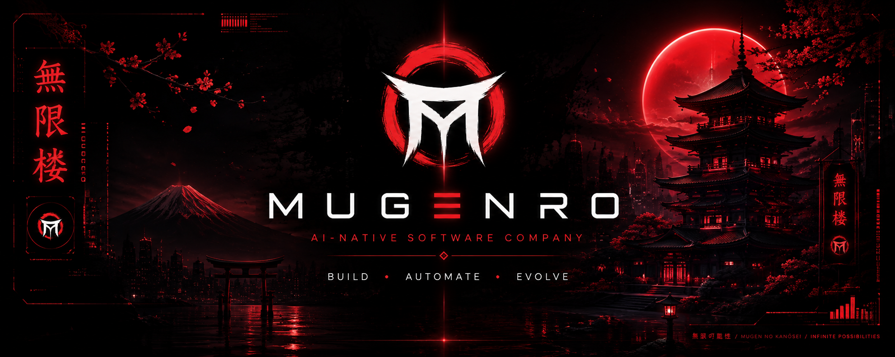

 

# MUGENRO

### AI-NATIVE SOFTWARE COMPANY

Building intelligent products, automation systems, and AI-powered tools.

 

[ Products ] · [ Technology ] · [ Research ] · [ GitHub ]

---

## ◈ About MUGENRO

MUGENRO is an AI-native software company focused on building intelligent software products and automation systems.

We combine **artificial intelligence, automation, software engineering, and product design** to create systems that are designed to evolve.

Our approach is simple:

> **Build systems that can understand, automate, and improve.**

---

## ◈ What We Build

- **AI-native software products**
- **Intelligent automation systems**
- **Developer tools**
- **AI agents and workflows**
- **Content creation platforms**
- **Financial & trading software**
- **Education technology**

---

## ◈ Products

### ShortsFactory

Automation platform for creating vertical short-form videos from video and audio assets.

**Focus:** content automation · media processing · AI workflows

---

### TraderOS

An intelligent software environment for traders.

**Focus:** analytics · workflow automation · decision support · trading tools

---

### Education Platform

A technology platform focused on modernizing education through intelligent software and AI-powered learning systems.

**Focus:** learning systems · AI · automation · education technology

---

## ◈ Technology

MUGENRO explores and builds with modern technologies across:

`Artificial Intelligence` · `Automation` · `Python` · `Software Engineering` · `AI Agents` · `Cloud Systems`

---

## ◈ Vision

We believe the next generation of software will not simply execute commands.

It will **understand problems, design solutions, build systems, and continuously improve.**

MUGENRO is being built toward that future.

---

### MUGENRO

**Build. Automate. Evolve.**

 

© 2026 MUGENRO

